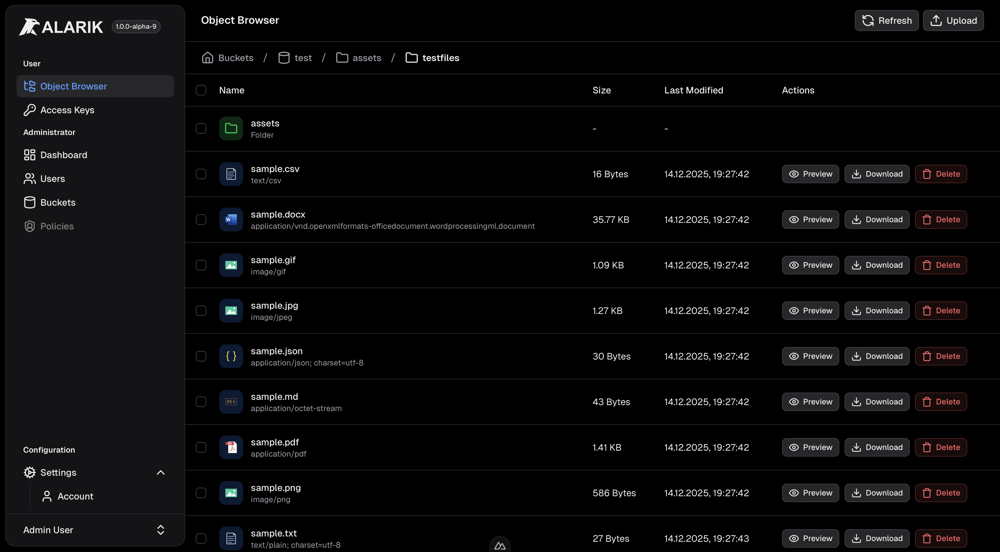
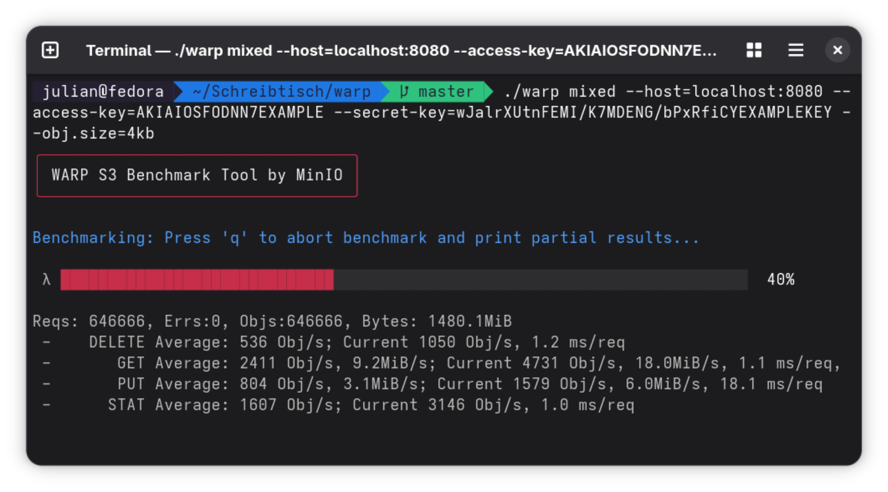
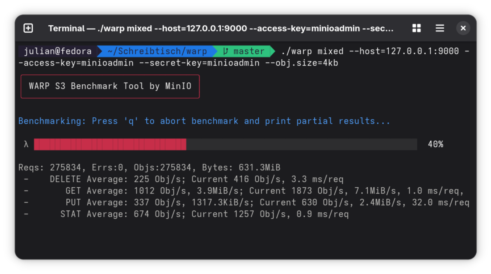

  

  

  
  
  

  

# Alarik - a High-Performance S3-Compatible Object Storage

Alarik is a high-performance, S3-compatible object storage system written in **Swift**, licensed under the **Apache 2.0** license. It aims to deliver exceptional speed, developer-friendly ergonomics, and a modern cloud-native core. See [Documentation](https://alarik.io/docs)

## Why Alarik?

Recent shifts in the ecosystem-especially surrounding MinIO-have revealed how fragile it is to depend on a single “reference” implementation for S3-compatible storage. These changes highlighted structural, licensing, and philosophical issues that many teams had long overlooked.

**Alarik exists to provide a modern, transparent, community-driven alternative.**
Developers and organizations need an S3-compatible store that is fast, simple to operate, easy to extend, and genuinely open-source. No licensing traps, no moving goalposts.

The goal: a self-hosted, high-speed S3 system built for today’s workloads, without the enterprise upsell.

## Installation

Please see [Documentation](https://alarik.io/docs/installation)

## Why Swift?

Swift brings a rare combination of **performance**, **safety**, and **developer ergonomics**:

-   **Fast**: Compiles to highly optimized native code with performance comparable to Rust or Go.
-   **Safe**: Memory-safe by design, eliminating entire classes of vulnerabilities common in C/C++ ecosystems.
-   **Modern tooling**: Clear syntax, excellent async/await model, first-class concurrency, and mature package management.
-   **Great for systems programming**: SwiftNIO and related libraries provide extremely efficient networking and I/O foundations.

Swift is an ideal fit for a new generation of cloud-native storage software.

## Future of Alarik

We are the ones behind the German Accounting-Software [belegFuchs](https://belegfuchs.de), and although we currently run MinIO in production, we are planning to migrate to Alarik in the future. This isn’t a marketing slogan - it’s a commitment that directly shapes our roadmap.

Because we rely on S3-compatible storage every day, we are fully invested in ensuring that Alarik continues to evolve: solid performance, long-term stability, and an open development model without licensing uncertainty. Our own planned adoption is a practical reason why we are committed to keeping Alarik actively maintained and moving forward.

**TL;DR:** Alarik is here to stay - it’s not going anywhere.

## Performance

Alarik is built with a strong focus on low-latency I/O and highly parallel request handling. New benchmarks on a dedicated Linux machine show that Alarik delivers competitive and in many cases superior throughput compared to MinIO or RustFS, even in early alpha stages.

### Benchmark Alarik vs MinIO

We use MinIO’s own benchmarking tool, `warp`, to measure performance. Both the object store and the benchmark client run on the same Linux host, ensuring results reflect raw engine performance rather than network conditions.

> These benchmarks represent the current state of the project. As Alarik’s storage engine and I/O pipeline continue to evolve, we expect performance to improve further.

#### Alarik

#### MinIO

## State of Development

Alarik is currently in **Alpha** - under rapid, active development.

-   Expect breaking changes and incomplete feature sets.
-   Core S3-compatible storage functionality is already operational.
-   Stabilization, documentation, and production-grade hardening are in progress.

Contributions, issues, feedback, and real-world testing are **highly encouraged**.

## Contributing

We welcome contributions of any size. Please:

-   Use `dev` branch as your base branch - not master
-   Use clear, descriptive commit messages
-   Open an issue before starting larger work
-   Follow Swift best practices
-   Add tests for new functionality where appropriate
-   Keep pull requests focused and incremental

More detailed contributing guidelines will be added soon.

---

## ⭐️ Stay Updated

More documentation, benchmarks, SDKs, and deployment guides are on the way.

If you believe in a future of open, community-driven, high-performance object storage, consider giving the repo a ⭐ and contributing!
